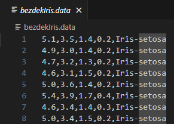

常见数据集格式：
1. CSV
以逗号分隔的文本文件，通常用于存储表格数据。
例子：Iris 数据集

5.1, 3.5, 1.4, 0.2：前四个数值是这朵花的特征，分别表示：
花萼长度（sepal length）: 5.1 cm
花萼宽度（sepal width）: 3.5 cm
花瓣长度（petal length）: 1.4 cm
花瓣宽度（petal width）: 0.2 cm
Iris-setosa：这是这朵鸢尾花的类别标签，表示它属于山鸢尾（Iris Setosa）物种。

2. JSON
支持层次结构和复杂数据结构。
[
  {
    "name": "Alice",
    "age": 30,
    "gender": "Female"
  },
  {
    "name": "Bob",
    "age": 25,
    "gender": "Male"
  }
]

3. XML
标记语言，支持自定义标签，适合存储和传输结构化数据。
<people>
  <person>
    <name>Alice</name>
    <age>30</age>
    <gender>Female</gender>
  </person>
  <person>
    <name>Bob</name>
    <age>25</age>
    <gender>Male</gender>
  </person>
</people>
4. Parquet
列式存储格式，适合大规模数据处理。
Parquet 文件通常是二进制格式，不易直接查看，适合通过工具读取（如 Apache Spark）。

5. HDF5 (Hierarchical Data Format)
用于存储和管理大型数据集的文件格式，支持复杂数据结构和元数据。
这个文件也通常是二进制格式，通常使用 h5py 等库读取。

6. Pickle
Python 的对象序列化格式，可以将 Python 对象保存为二进制文件。
通常是二进制格式，使用 Python 的 pickle 模块进行序列化和反序列化。
import pickle
data = {'name': 'Alice', 'age': 30}
with open('data.pkl', 'wb') as f:
    pickle.dump(data, f)
