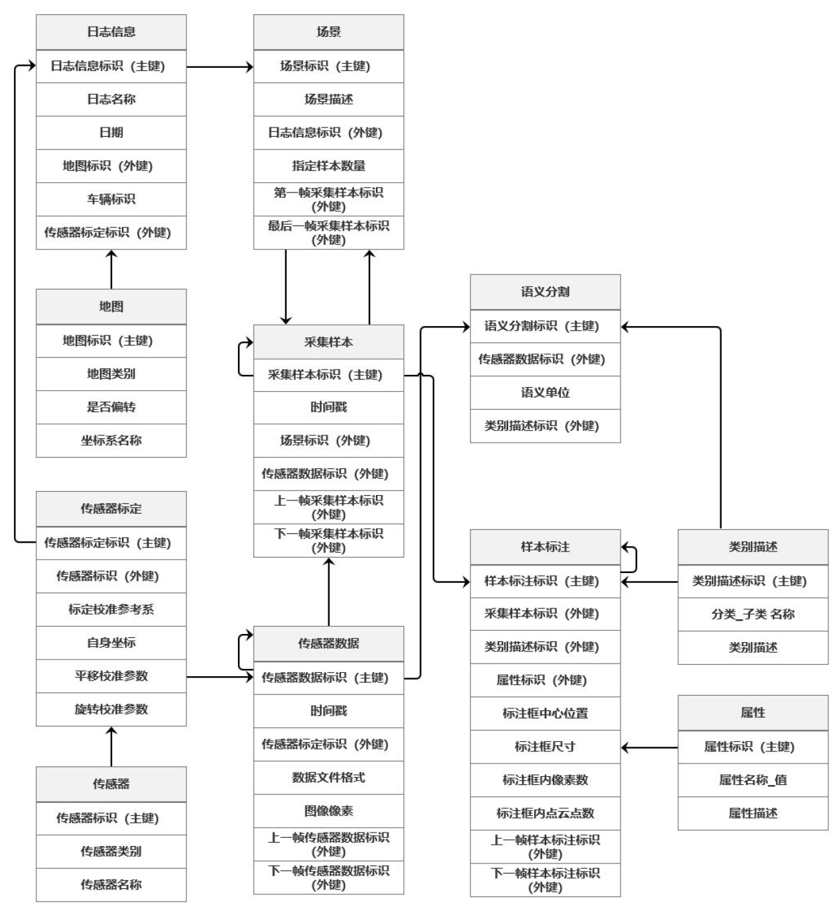

# 《智能网联汽车感知训练数据集标准化需求研究报告》关键信息摘取

1. 感知训练数据集研究背景

   - 数据集主要分为：**车端**和**路端**

   - 车端数据集复杂多样，不仅包含驾驶数据集，还有交通标志数据集、行人数据集、车道线检测数据集等。主要有：**高清图像**，点云，**3D标注物体图像**，**3D和2D框**，3D和2D行驶轨迹，**3D实例标记**...
   - 路端感知数据集比较少，数据采集场景多为交通路口，一般是**图像**、**点云数据**
   - 通用数据标注一般分为：**人工标注**，**半自动标注**，**全自动标注**。
   - 自动驾驶标注任务一般是：**传感器融合标注**（增大感知范围与精度），**路径与轨迹标注**（目标跟踪，轨迹检测），**场景理解标注**（标注场景相关信息）

2. 感知数据采集及传感器部署方案研究

   1. 车端

      - 采集车的各类型号：需要同时考虑通用需求和特殊需要。

      - 传感器选型：激光雷达，单/双/三目摄像机，鱼眼摄像机，环视摄像机，毫米波雷达等。

      - 传感器配置：5-8个摄像机，装在车顶、后视镜下方、前侧翼子板，前后车标、后备箱等。1-3激光雷达布置在采集车上方离地2-3m处。

      - 采集系统配置：主要包括外部感知设备、与外部设备相连接的交换机、同步盒、电源模块，数据融合单元，数据采集与存储系
        统，最终上传到工控机或云端服务器进行存储。

   2. 路端

      - 暂时认为不重要

3. 感知训练数据集数据属性和要求

   - 针对图像2D目标检测算法数据集、图像目标追踪算法数据集、图像主义分割算法数据集等多种数据集进行了**标注范围、类别、属性**上的明确，比如：Vehicle, Human, 里面可以有子类别，比如Car, Bus, Pedestrian, Rider.属性诸如Occluded,Truncated, Posture等等。
   - 针对训练数据标注精确度，一般有如下几方面需要考虑：抽检比例，准确率，贴合度，航向角，连续帧的最短间隔时长，速度的标注以及最大误差，图像标注的像素误差。
   - 针对图像、点云数据不同标注项，推荐不同的导出格式。

4. 感知训练数据集测评方法

   - 针对图像质量和点云数据质量提供了多种定量的评价指标

最后文件还给出了感知数据集数据结构的参考：

